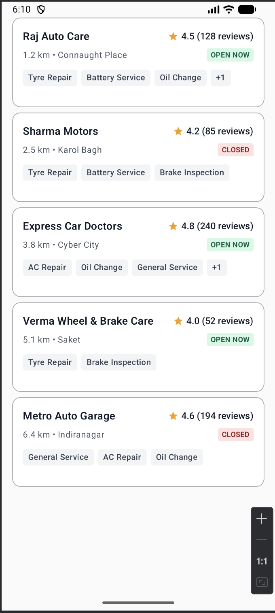
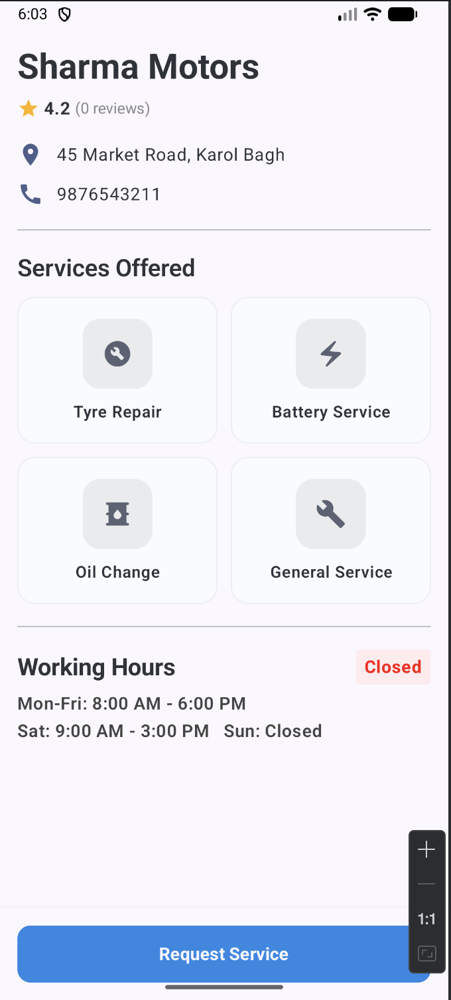
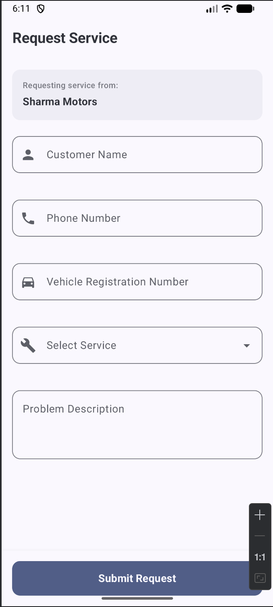
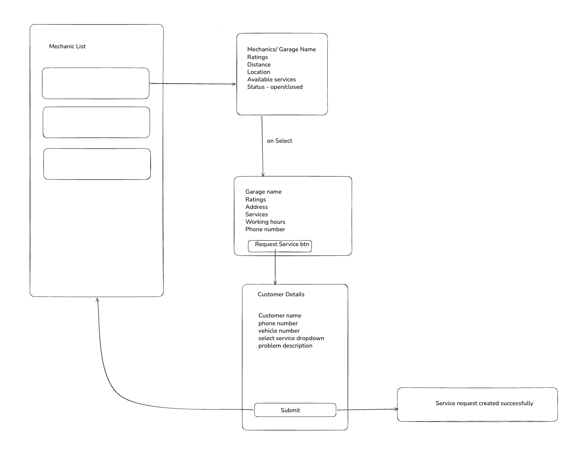

# Instant Mechanic 🚗🔧

Instant Mechanic is a mini Android application built as an internship assignment. It allows users to browse mechanics, view garage details, and request vehicle services through a simple and user-friendly interface.


## Screenshots

### Home Screen


### Mechanic Details Screen


### Request Service Screen



## Features

### Home Screen

* Displays available mechanics
* Garage name and rating
* Distance and location
* Available services
* Open/Closed status
* Loading and error state handling

###  Mechanic Details

* Garage name and rating
* Open/Closed status
* Address
* Working hours
* Phone number
* Available services
* Request Service button

### Request Service

Users can submit a service request by providing:

* Customer name
* Phone number
* Vehicle number
* Required service
* Problem description

The form includes basic validation and displays a confirmation message after successful submission.

## Tech Stack

* **Kotlin**
* **Jetpack Compose**
* **MVVM Architecture**
* **Kotlin Coroutines**
* **StateFlow**
* **Hilt** – Dependency Injection
* **Retrofit** – REST API integration
* **Gson** – JSON parsing
* **Jetpack Navigation**

## Architecture

The application follows a simple layered architecture:

### Work Flow Design


```text
Presentation
    ↓
ViewModel
    ↓
Repository
    ↓
Remote API
    ↓
Retrofit
```

### Project Structure

```text
com.example.instantmechanic
├── data
│   ├── dummy
│   │   └── DummyMechanicsData
│   ├── network
│   │   └── NetworkModule
│   ├── remote
│   │   └── MechanicApiService
│   └── repository
│       └── MechanicRepository
├── domain.model
│   └── Mechanic.kt
└── presentation
    ├── components
    │   ├── ErrorScreen.kt
    │   └── ServiceCard.kt
    ├── details
    │   └── MechanicDetailsScreen.kt
    ├── home
    │   ├── HomeScreen.kt
    │   └── MechanicUiState
    ├── navigation
    │   ├── AppNavHost.kt
    │   └── Screen
    ├── service
    │   └── RequestServiceScreen.kt
    └── viewModel
        └── MechanicViewModel
```

## API Integration

The application uses **Retrofit** for REST API communication and **Gson** for JSON parsing.

A mock REST API is used for the assignment:

```text
 // backend api will add late
```


The API response is converted into application data through the Repository layer.

## Navigation Flow

```text
Home
  ↓
Mechanic Details
  ↓
Request Service
  ↓
Service Request Confirmation
  ↓
Home
```

## Getting Started

1. Clone the repository.

```bash
git clone https://github.com/deepak5204/UserExplorerApp
```

2. Open the project in Android Studio.
3. Sync the Gradle dependencies.
4. Run the application on an emulator or Android device.

## Assignment Requirements Covered

* ✅ Kotlin Android application
* ✅ Jetpack Compose UI
* ✅ REST API integration
* ✅ JSON parsing
* ✅ Loading state
* ✅ Error handling
* ✅ Mechanic listing
* ✅ Mechanic details
* ✅ Service request form
* ✅ Form validation
* ✅ Navigation between screens
* ✅ MVVM-based architecture
* ✅ Dependency Injection using Hilt
